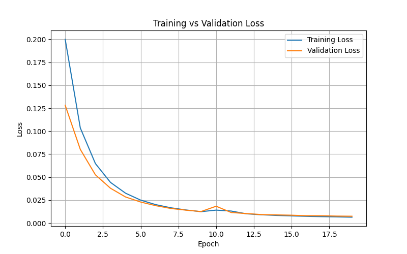
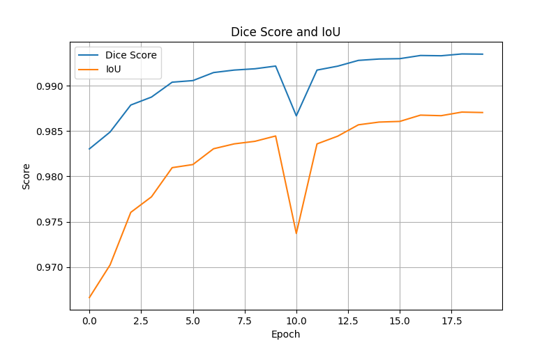
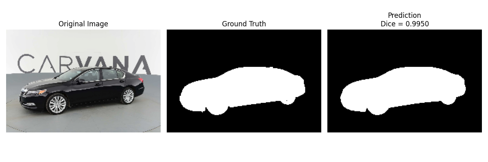
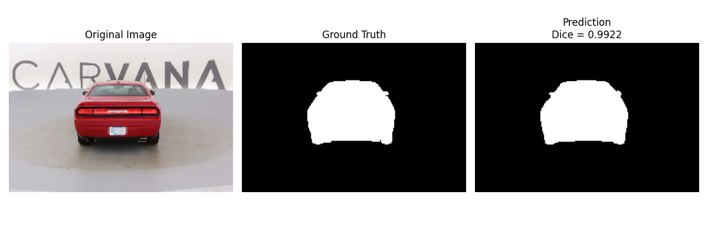
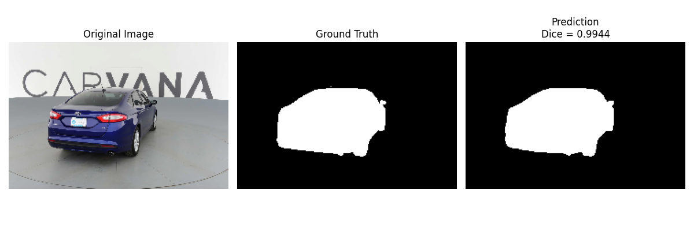
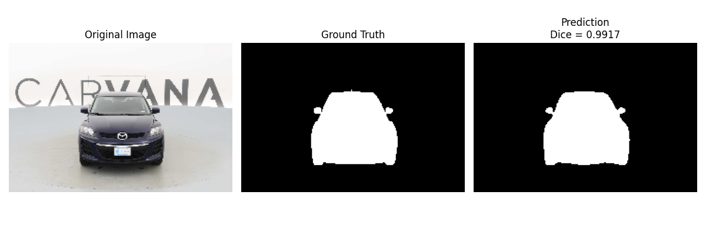
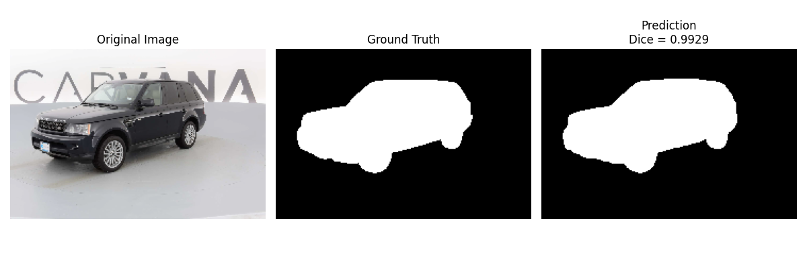

# U-Net Semantic Image Segmentation using PyTorch

## Overview

This project implements the **U-Net** architecture from scratch using **PyTorch** for binary semantic image segmentation. The model is trained on the **Carvana Image Masking Challenge** dataset to accurately segment vehicles from the background.

The objective of this project is to understand the complete semantic segmentation pipeline, including dataset preparation, preprocessing, model training, validation, evaluation, checkpointing, and prediction visualization.

---

## System Description

**Dataset Preparation**
- Train-validation dataset split
- Image-mask pairing
- Data augmentation using Albumentations

**Training**
- U-Net Encoder-Decoder architecture
- Skip Connections
- Binary Cross Entropy Loss with Logits
- Adam Optimizer
- GPU (CUDA) acceleration

**Evaluation**
- Validation Loss
- Dice Score
- Intersection over Union (IoU)

**Output**
- Segmentation mask prediction
- Training history graphs
- Prediction comparison images
- Best model checkpoint

---

## Model Architecture

The implemented U-Net follows the original encoder-decoder design proposed by Ronneberger et al.

<p align="center">

</p>

The architecture consists of:

- Contracting Path (Encoder)
- Bottleneck Layer
- Expanding Path (Decoder)
- Skip Connections
- Final 1×1 Convolution for Binary Segmentation

---

## Project Structure

```
UNET_project/
│
├── UNET_data/
│   ├── train_images/
│   ├── train_masks/
│   ├── val_images/
│   └── val_masks/
│
├── checkpoints/
│
├── results/
│   ├── loss_curve.png
│   ├── metrics_curve.png
│   ├── prediction_1.png
│   ├── prediction_2.png
│   ├── prediction_3.png
│   ├── prediction_4.png
│   ├── prediction_5.png
│   └── UNET_architecture.png
│
├── split_dataset.py
├── UNET_config.py
├── UNET_dataset.py
├── UNET_model.py
├── UNET_seed.py
├── UNET_train.py
└── README.md
```

---

## Key Features

- Complete U-Net implementation from scratch
- Binary semantic segmentation
- Albumentations data augmentation
- Automatic training-validation split
- Dice Score and IoU evaluation
- Automatic checkpoint saving
- GPU (CUDA) support
- Training history visualization
- Prediction comparison visualization

---

## Training Configuration

| Parameter | Value |
|-----------|-------|
| Framework | PyTorch |
| Dataset | Carvana Image Masking Challenge |
| Optimizer | Adam |
| Loss Function | BCEWithLogitsLoss |
| Learning Rate | 1e-4 |
| Batch Size | 16 |
| Epochs | 10 |
| Device | CUDA |
| Random Seed | 42 |

---

## Evaluation Metrics

The model performance is evaluated using:

- Validation Loss
- Dice Score
- Intersection over Union (IoU)

---

## Training Results

### Training vs Validation Loss

<p align="center">

</p>

The loss curves show steady convergence with both training and validation loss decreasing consistently, indicating stable learning without noticeable overfitting.

---

### Dice Score and IoU

<p align="center">

</p>

The evaluation metrics improve throughout training, demonstrating that the model learns accurate pixel-level segmentation.

Final performance after **10 epochs**:

- Dice Score ≈ **0.992**
- IoU ≈ **0.984**

---

## Sample Predictions

### Prediction 1

<p align="center">

</p>

---

### Prediction 2

<p align="center">

</p>

---

### Prediction 3

<p align="center">

</p>

---

### Prediction 4

<p align="center">

</p>

---

### Prediction 5

<p align="center">

</p>

The predicted masks closely match the ground truth masks, demonstrating high segmentation accuracy across different vehicle orientations.

---

## Requirements

- Python 3.11+
- PyTorch
- torchvision
- Albumentations
- OpenCV
- NumPy
- Matplotlib
- tqdm

Install dependencies:

```bash
pip install -r requirements.txt
```

---

## How to Run

### Clone the repository

```bash
git clone https://github.com/YourUsername/UNET_project.git

cd UNET_project
```

---

### Prepare Dataset

Download the Carvana dataset from Kaggle and place it inside

```
UNET_data/
```

Run

```bash
python split_dataset.py
```

This creates the validation dataset automatically.

---

### Train the Model

```bash
python UNET_train.py
```

During training, the program automatically:

- Trains the U-Net model
- Evaluates on the validation dataset
- Saves the best checkpoint
- Generates loss and metric graphs
- Saves prediction comparison images

---

## Learning Outcomes

This project demonstrates practical understanding of:

- Semantic Segmentation
- Encoder-Decoder Networks
- Skip Connections
- Binary Image Segmentation
- PyTorch Model Development
- Dataset Handling
- GPU Training with CUDA
- Dice Score and IoU Evaluation
- Deep Learning Training Pipeline

---

## Possible Extensions

- Multi-class Semantic Segmentation
- Mixed Precision Training (AMP)
- Learning Rate Scheduler
- Early Stopping
- Attention U-Net
- UNet++
- SegFormer
- Vision Transformer (ViT)
- Swin Transformer

---

## References

1. Olaf Ronneberger, Philipp Fischer, Thomas Brox. *U-Net: Convolutional Networks for Biomedical Image Segmentation*. MICCAI, 2015.

2. PyTorch Documentation

3. Albumentations Documentation

4. Carvana Image Masking Challenge Dataset

5. Aladdin Persson's U-Net Implementation (used as a learning reference)

---

## Author

**Priyanshu Nayak**

B.Tech Electrical Engineering

Indian Institute of Technology Bhubaneswar (Summer Research Intern)

Research Interest: Computer Vision • Deep Learning • AR/VR • Vision Transformers